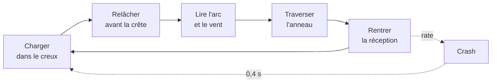
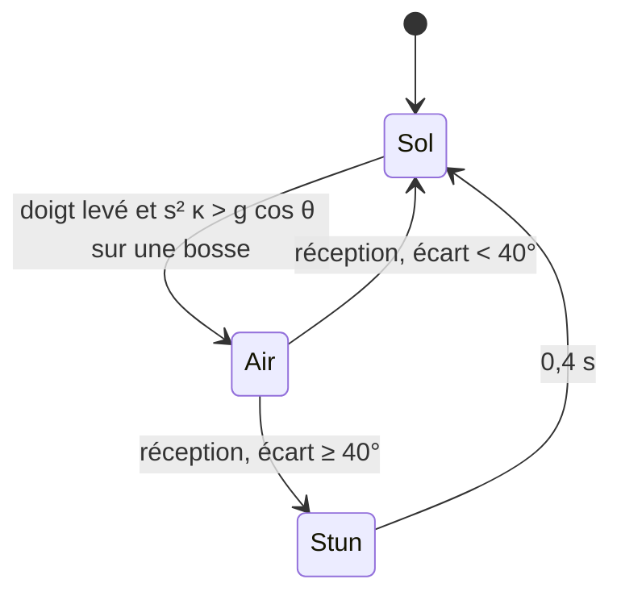

# Houle : spec v2

> Descente infinie de dunes, vue de côté, un seul doigt, 60 secondes. Tu maintiens pour te plaquer dans la pente et charger, tu relâches avant la crête pour décoller, tu traverses des anneaux en vol. Le score, c'est ce que tu attrapes en l'air.
>
> v2 du 18/09/2026, écrite par Claude Fable 5.1 à partir du brief v1 « Mini-jeu week-end ». Lue par l'agent qui code (Opus 5) et par Tristan. Le brief v1 reste la référence d'intention, ce fichier est la référence d'exécution : en cas d'écart, ce fichier gagne.

## 0. Ce que la v2 change par rapport au brief v1

| # | Changement | Pourquoi |
|---|---|---|
| 1 | **Constantes de terrain recalculées** | Les valeurs v1 (`HILL_BASE` 260, `HILL_WAVE` 520) donnent une pente max de 3,14, soit des falaises à 72°. Impossible à jouer. |
| 2 | **Le décollage est une règle physique exacte** (courbure contre gravité), et **doigt posé = collé au rail** | v1 disait « si le doigt est levé au bon moment », sans définir le moment. Ici le timing du relâcher choisit l'angle de tir, la charge choisit la puissance. |
| 3 | **En vol, doigt levé = le personnage s'aligne sur sa trajectoire** ; doigt posé = backflip | Sans ça, chaque saut sans flip complet est un crash (la pente de réception descend, le nez pointe en l'air). C'est la règle qui rend la session 2 jouable. |
| 4 | **Anneaux placés en simulant la vraie physique** | Atteignables par construction, avec le vent de la seed inclus. |
| 5 | **Contrat des modules écrit** : signatures, objet `state`, événements | L'agent code un fichier à la fois sans casser les autres. |
| 6 | **Pas de temps fixe** (1/120 s) avec accumulateur borné | Même feel à 60 et 120 Hz, plus de téléportation après un lag. |
| 7 | **Unités monde indépendantes de l'écran** (vue haute de 800 u) | Même jeu sur un iPhone et sur un écran 27 pouces. |
| 8 | **Personnage lisible en rotation** | Un cercle ne montre pas un flip. |
| 9 | **Pipeline téléphone** : chaque push déploie une URL de preview par branche en 60 s | La boucle « je dis une sensation, je rejoue » se fait sans le Mac. |
| 10 | **Filet anti page blanche** (`check.sh`) | En ES modules sans build, une faute de syntaxe = page blanche sans message. Et `file://` ne charge pas les modules dans Chrome ni Safari : il faut un serveur statique, même en local. |
| 11 | **Un chrono à 0 n'interrompt pas un vol** | Le dernier tir compte, c'est la fin de run la plus satisfaisante possible. |
| 12 | **Un vol sans anneau casse la chaîne** | Sinon la chaîne mesure la survie, pas l'adresse. |
| 13 | **Definition of done par session**, mesurable sur téléphone | « Quelque chose de jouable » ne se vérifie pas. |

## 1. Le jeu

**Une descente infinie de dunes, vue de côté, un seul doigt.** Doigt posé : tu es plaqué à la pente, tu accélères fort en descente, tu freines en montée, et tu ne décolles jamais. Doigt levé : la physique décide, et sur le haut d'une bosse, à la vitesse que tu as chargée, tu pars en l'air. Des anneaux flottent sur l'arc d'un bon saut : les traverser rapporte des points. Tu retombes, tu recharges, tu recommences.

Une run dure 60 secondes. Un crash n'est pas une mort : tu perds ta vitesse et ta chaîne, tu repars sur place. Aucun écran entre deux tentatives.

### La boucle



### L'intention

Un seul input, **trois lectures selon le contexte** : au sol il plaque, à la crête il tire, en l'air il fait tourner. C'est le pont entre le flow (Trackmania, Dune!, ski) qui interdit de s'arrêter, et le shot (golf, basket, Worms) qui l'exige. Ici le tir est un moment du flow.

**Le cœur doit être agréable sans un seul anneau.** Si la descente seule n'est pas satisfaisante, aucune couche ajoutée ne la sauvera. C'est le test du samedi soir, et c'est le plus important du week-end.

### Le geste de golf, en détail

Sur une bosse, la physique t'arrache du sol dès que la vitesse dépasse ce que la gravité peut retenir dans le virage (voir §4). Ça n'arrive que doigt levé, et seulement entre le point d'inflexion (là où la montée commence à s'arrondir) et le sommet.

- **Relâcher tôt**, juste après l'inflexion : pente raide, tir haut et court.
- **Relâcher tard**, près du sommet : tir tendu et long.
- **Ne pas relâcher** : tu restes collé, tu passes la bosse au sol, pas de tir.
- **La vitesse au moment du relâcher** est la puissance. Elle vient de la charge dans le creux d'avant.

Deux paramètres continus (angle, vitesse) tenus par un seul booléen et son timing. C'est tout le jeu.

## 2. Stack et contraintes

**Canvas 2D, JavaScript vanilla, modules ES, zéro dépendance, zéro asset, zéro build.**

| Contrainte | Décision |
|---|---|
| Rendu | Un seul `<canvas>` plein écran. HUD et écrans en DOM par-dessus (texte net, safe areas gratuites) |
| Moteur | Aucun. Ni Phaser, ni Three, ni Matter |
| Build | Aucun. `npm` n'est jamais lancé. `package.json` existe pour dire `"type": "module"` à Node, rien d'autre |
| Images, polices | Aucune. Tout est dessiné par du code. Police système |
| Son | WebAudio synthétisé, aucun fichier audio |
| Stockage | `localStorage` : record par seed, record global |
| Hébergement | GitHub Pages, branche `gh-pages`, déployée par Actions à chaque push (§12) |
| Serveur local | `python3 -m http.server 8000 --directory game` (stdlib). 🚨 `file://` ne charge pas les modules ES dans Chrome ni Safari |
| Perf | 60 fps sur un téléphone milieu de gamme. Une boucle `requestAnimationFrame`, pas d'allocation dans la boucle |
| Orientation | Conçu en portrait. Tourne en paysage sans être optimisé, aucun overlay |

### Unités monde

- **1 unité (u) = 1 pixel CSS sur un écran de 800 px de haut.** La vue fait toujours `VIEW_H = 800` u de haut ; sa largeur dépend de l'écran (≈ 370 u sur un iPhone, ≈ 1 280 u sur un 16/10).
- `scale = hauteurCanvasCss / 800`. Tout le monde (physique, terrain, anneaux) vit en u. Seul `render.js` connaît `scale`.
- **Axe y vers le bas** (convention canvas). La gravité est positive. Une **crête est un minimum local de `h(x)`**, un creux un maximum local. Un angle positif tourne dans le sens horaire à l'écran, comme `ctx.rotate`.
- `devicePixelRatio` plafonné à 2.

### Pourquoi la 2D et le zéro asset

La mécanique est une courbe lue de profil : au relâcher il faut voir l'angle de la pente quittée et l'arc à venir, gratuit en 2D. Le zéro asset est la seule raison pour laquelle le projet tient en deux jours : tout le budget va au réglage du feel.

## 3. Architecture

### Fichiers

| Fichier | Rôle | Pur ? | Taille visée |
|---|---|---|---|
| `game/index.html` | Canvas, HUD, écrans en `<section hidden>` | | 60 lignes, **écrit** |
| `game/style.css` | Mise en page, pièges mobiles, palette en variables CSS | | 150 lignes, **écrit** |
| `game/main.js` | Boucle, pas fixe, input, machine à états, DOM des écrans | non | 220 lignes |
| `game/physics.js` | `TUNING`, `createState`, `step`, décollage, vol, réception, crash, chrono | **oui** | 220 lignes |
| `game/terrain.js` | Terrain seedé, `h`, `h'`, `h''`, crêtes, inflexions, couches de fond | **oui** | 110 lignes |
| `game/rings.js` | Placement des anneaux par simulation, traversée, chaîne, score | **oui** | 120 lignes |
| `game/rng.js` | `mulberry32` | **oui** | 10 lignes, **écrit** |
| `game/render.js` | Tout le dessin : ciel, parallaxe, terrain, anneaux, personnage, particules, secousse | non | 300 lignes |
| `game/audio.js` | Oscillateurs WebAudio | non | 110 lignes |

Environ 1 300 lignes. Les fichiers marqués **écrit** existent déjà et se modifient, ils ne se recréent pas.

### La séparation qui compte

**`physics.js`, `terrain.js`, `rings.js`, `rng.js` ne connaissent ni `document`, ni `window`, ni `canvas`, ni `performance`, ni `Date`.** Ce sont des fonctions pures sur `state`, elles tournent dans Node (`check.sh` les importe). Tout le game feel vit là, réglable par constantes, sans jamais toucher au rendu.

`render.js` et `audio.js` **lisent** `state` et n'y écrivent jamais. Ce qu'ils ont besoin de savoir (un décollage, un anneau traversé, un crash) leur arrive par `state.events`, une liste de chaînes que `physics.step` remplit et que `main.js` vide après chaque lot de pas.

### Contrat des modules

```js
// rng.js
export function mulberry32(seed) → () => number   // [0, 1), déterministe

// terrain.js
export function create(seed) → terrain
  terrain.sample(x)            → { y, dy, ddy }      // hauteur, pente, courbure, analytiques
  terrain.crests(x0, x1)       → [{ x, y }]          // minima locaux de h dans [x0, x1]
  terrain.inflectionBefore(xc) → x                   // dernier x < xc où ddy passe de négatif à positif
  terrain.layer(k, x)          → y                   // silhouette de fond k ∈ {1, 2}, espace écran
  terrain.wind                 → number              // u/s², tiré de la seed après les phases

// physics.js
export const TUNING = { ... }                        // §10, seul endroit des constantes de feel
export const STEP = 1 / 120
export function createState(seed) → state            // §3 objet state, appelle terrain.create
export function step(state, dt)                      // UN pas fixe, remplit state.events
export function canTakeOff(s, dy, ddy)  → boolean    // critère de décollage, partagé avec rings.js
export function simulateFlight(terrain, x, y, vx, vy, wind) → { apex: {x, y}, land: {x, y}, t }
export function wrapAngle(a) → number                // dans ]-π, π]

// rings.js
export function ensure(state, uptoX)                 // génère les anneaux des crêtes jusqu'à uptoX (pool)
export function check(state, px, py)                 // teste la traversée sur le segment (px,py) → (state.x, state.y)
export function breakChain(state)

// render.js
export function init(canvas)                         // lit la palette CSS une fois, alloue les pools
export function resize(w, h, dpr)
export function draw(state, dt)                      // dessine une frame, avance particules et secousse
export function fx(event, state)                     // particules et secousse déclenchées par un événement

// audio.js
export function init()                               // AudioContext, uniquement dans un pointerdown
export function play(name, level)                    // 'takeoff' | 'ring' | 'land_perfect' | 'land_ok' | 'crash' | 'end'
export function setCharge(charge, active)            // bourdonnement de charge, gain rampé
export function suspend() / resume()
```

### L'objet `state`

```js
{
  phase: 'title' | 'run' | 'end',
  seed, terrain, wind,               // terrain = terrain.create(seed), wind en u/s²
  t: 0,                              // temps de run écoulé en secondes RÉELLES (chrono = RUN_TIME - t)
  ending: false,                     // chrono à 0, on attend la fin du vol en cours
  x, y, vx, vy,                      // position (u) et vitesse (u/s)
  s,                                 // vitesse scalaire au sol (u/s), toujours ≥ MIN_SPEED
  angle,                             // orientation du personnage (rad), horaire positif
  grounded: true,
  pressed: false,
  airTime: 0,                        // durée du vol en cours (temps ralenti)
  flightRings: 0,                    // anneaux traversés pendant le vol en cours
  stun: 0,                           // temps de crash restant (s)
  charge: 0,                         // (s - MIN_SPEED) / (MAX_SPEED - MIN_SPEED), pour la jauge, la traînée, le zoom
  score: 0, chain: 0, mult: 1, best: 0,
  rings: [],                         // pool de RING_POOL anneaux { x, y, r, kind, value, active, hit }
  ringsUpto: 0,                      // x jusqu'où les anneaux sont générés
  events: [],                        // chaînes : 'takeoff' 'ring' 'land_perfect' 'land_ok' 'crash' 'end'
  lastLanding: { quality: '', diff: 0, flips: 0 },
  cam: { x, y, zoom },
}
```

Les particules, la traînée et la secousse sont internes à `render.js` : ce sont des effets, pas de l'état de jeu.

## 4. Mécanique

Quatre états. L'input est un booléen, sa signification dépend de l'état.



### Pas fixe

`main.js` accumule le temps de frame **borné à 1/30 s** (c'est la ligne la plus importante du fichier : sans elle, un lag d'une seconde traverse le terrain), et appelle `physics.step(state, STEP)` tant que l'accumulateur dépasse `STEP = 1/120`. En vol, `step` multiplie son `dt` par `AIR_TIME_SCALE` pour la position, la rotation et `airTime`. Le chrono `state.t` avance toujours en temps réel.

### Au sol

```js
const { y, dy, ddy } = terrain.sample(x)
const tx = 1 / Math.sqrt(1 + dy * dy), ty = dy * tx     // tangente unitaire, y vers le bas
const gEff = GRAVITY * (pressed ? PRESS_MULT : 1)
s += gEff * ty * dt                                      // dy > 0 : descente, accélère ; dy < 0 : montée, freine
s -= FRICTION * s * dt
s = clamp(s, MIN_SPEED, MAX_SPEED)
x += s * tx * dt
y = terrain.sample(x).y                                  // recalé sur la courbe, jamais d'accumulation d'erreur
angle = Math.atan2(dyNouveau, 1)                         // planche alignée sur la pente
vx = s * tx ; vy = s * ty
charge = (s - MIN_SPEED) / (MAX_SPEED - MIN_SPEED)
```

Pas de bouton d'accélération, pas de frein. Le personnage avance toujours vers la droite (`s ≥ MIN_SPEED`), une montée le ralentit sans jamais le retourner.

### Le décollage

Après le pas au sol, **si le doigt est levé** :

```js
const kappa = ddy / Math.pow(1 + dy * dy, 1.5)           // courbure signée
const cosTheta = 1 / Math.sqrt(1 + dy * dy)
if (ddy > 0 && s * s * kappa > GRAVITY * cosTheta) {     // le sol s'incurve vers le bas plus vite que la gravité ne retient
  grounded = false ; airTime = 0 ; flightRings = 0
  events.push('takeoff')                                 // vx, vy sont déjà la vitesse tangentielle
}
```

C'est le critère centripète exact : sur une bosse (`ddy > 0`), le sol ne peut que pousser, jamais retenir. `canTakeOff(s, dy, ddy)` exporte ce test pour que `rings.js` place ses anneaux avec la même règle. **Doigt posé, ce test n'est jamais évalué** : plaqué, on ne décolle pas, quelle que soit la vitesse.

Pendant `airTime < TAKEOFF_GRACE` (0,05 s), pas de test de contact avec le sol, sinon le premier tick retombe sur la courbe.

### En vol

```js
dt *= AIR_TIME_SCALE
vx += wind * dt
vy += GRAVITY * dt
x += vx * dt ; y += vy * dt
airTime += dt
if (pressed) {
  angle -= ROT_SPEED * dt                               // backflip : le nez monte
} else {
  const target = Math.atan2(vy, vx)                     // direction de la trajectoire
  const d = wrapAngle(target - angle)
  if (Math.abs(d) < ALIGN_ZONE) angle += d * (1 - Math.exp(-ALIGN_RATE * dt))   // s'aligne sur l'arc, mais ne rattrape pas un flip lâché à l'envers
}
```

Le ralenti (`AIR_TIME_SCALE`) n'est pas un effet, c'est ce qui rend la visée possible au doigt. Le vent est constant sur toute la run, tiré de la seed, affiché en haut de l'écran : une condition à lire avant de lâcher.

### La réception

Contact quand `y ≥ terrain.sample(x).y` et `airTime ≥ TAKEOFF_GRACE`.

```js
const slope = Math.atan2(dy, 1)
const diff = wrapAngle(angle - slope)
const flips = Math.round((angle - slope) / (2 * Math.PI))      // flips complets rentrés
const sTan = vx * tx + vy * ty                                  // vitesse projetée sur la pente
if (Math.abs(diff) < LAND_PERFECT) {
  s = sTan * PERFECT_BOOST * (flips ? FLIP_BOOST ** Math.abs(flips) : 1) ; events.push('land_perfect')
} else if (Math.abs(diff) < LAND_FAIL) {
  const k = (Math.abs(diff) - LAND_PERFECT) / (LAND_FAIL - LAND_PERFECT)
  s = sTan * (1 - LAND_LOSS * k) ; events.push('land_ok')
} else {
  crash()
}
s = clamp(s, MIN_SPEED, MAX_SPEED) ; grounded = true ; y = ground.y ; angle = slope
if (flightRings === 0) breakChain(state)                        // un vol sans anneau casse la chaîne
if (ending) → phase 'end', events.push('end')
```

| Écart | Résultat |
|---|---|
| < 15° | Parfait : vitesse conservée et bonus, un flip complet rentré ajoute `FLIP_BOOST` par flip |
| 15° à 40° | Correct : perte de vitesse proportionnelle, jusqu'à 45 % |
| ≥ 40° | Crash |

Un flip rentré de travers est un crash : c'est la seule punition du jeu, et elle suffit.

### Le crash

`crash()` : `s = CRASH_SPEED`, `stun = CRASH_STUN`, `breakChain`, `events.push('crash')`. Pendant `stun`, l'input est ignoré, le personnage glisse au sol à `CRASH_SPEED` sans décoller, et `angle` tourne à `CRASH_SPIN` rad/s pour montrer la culbute. Pas d'écran, pas de bouton. Le seul vrai game over est le chrono.

### Le chrono

`RUN_TIME = 60` s. `t` avance en temps réel dès le premier `pointerdown` (qui pose aussi `pressed = true` : le même geste lance la run et commence à charger). À `t ≥ RUN_TIME` : au sol, la run se termine tout de suite ; en vol, `ending = true` et la run se termine à la réception. Le HUD affiche `0` en clignotant pendant ce dernier vol.

### Le départ

`x = 0`, au sol, `s = START_SPEED`, sur une crête : la phase du premier octave est fixée à `3π/2` pour que toutes les seeds démarrent sur un sommet et descendent. Les 2 premières secondes sont une descente : le joueur comprend « maintenir = accélérer » avant la première bosse.

## 5. Terrain

Somme de 3 sinusoïdes à amplitude lentement modulée, plus une pente moyenne descendante. Pas de bruit de Perlin : plus simple, plus lisse, et **dérivable analytiquement**, ce que le critère de décollage exige à chaque pas.

```
h(x)  = SLOPE_AVG · x + Σᵢ Aᵢ(x) · sin(kᵢ x + φᵢ)          i = 0, 1, 2
Aᵢ(x) = HILL_BASE · OCT_AMP[i] · (1 + MOD_DEPTH · sin(mᵢ x + ψᵢ))
kᵢ    = 2π / (HILL_WAVE · OCT_WAVE[i])
mᵢ    = kᵢ / MOD_WAVE
```

`sample(x)` rend `y = h(x)`, `dy = h'(x)`, `ddy = h''(x)` en une seule passe (règle du produit, une dizaine de lignes). Aucune différence finie nulle part.

- `φ₀ = 3π/2` fixé (départ sur une crête), `φ₁`, `φ₂`, `ψ₀`, `ψ₁`, `ψ₂` tirés de `mulberry32(seed)` dans cet ordre, puis le vent. **L'ordre des tirages fait partie du contrat** : le changer change toutes les pistes déjà partagées.
- `crests(x0, x1)` : balayage tous les 8 u, `dy` qui passe de négatif à positif, puis 4 bissections. `inflectionBefore(xc)` : balayage arrière depuis la crête jusqu'au premier `ddy ≤ 0`.
- Avec les constantes de §10, la pente max vaut ≈ 0,82 (39°) sur l'octave principal, ≈ 1,0 en cumul typique, ≈ 1,6 dans le pire alignement. Un sandboard, pas une falaise.
- **Couches de fond** : `layer(k, xScreen)` utilise la même somme de sinus avec d'autres amplitudes et sans `SLOPE_AVG`, sur une **baseline fixe en espace écran** (45 % de la hauteur pour les montagnes, 60 % pour les collines), et défile en x à son facteur de parallaxe. Aucun code de dessin supplémentaire.

## 6. Anneaux, vent, score, seed

### Placement des anneaux

Pas aléatoires : posés sur l'arc réel d'un saut, en simulant la physique du jeu. Pour chaque crête `xc` (générées à la volée jusqu'à `cam.x + RING_LOOKAHEAD`, pool de `RING_POOL`, recyclage derrière la caméra) :

1. `xi = inflectionBefore(xc)`. Balayer de `xi` vers `xc` tous les 4 u, et prendre le premier x où `canTakeOff(sRef, dy, ddy)` : c'est le point de décollage d'un joueur arrivant relâché à `sRef`.
2. `simulateFlight(terrain, x, y, sRef·tx, sRef·ty, wind)` → apex.
3. **Anneau facile** : `sRef = RING_EASY_SPEED · MAX_SPEED`, posé à l'apex. **Anneau difficile** : `sRef = RING_HARD_SPEED · MAX_SPEED`, posé à l'apex, atteignable seulement avec une charge quasi parfaite.
4. Si l'anneau difficile est à moins de 70 u du facile, le décaler à 60 % de la descente de son arc. Si un anneau est sous le sol (`y > h(x) - 40`), le supprimer. Un jitter de ± 12 u tiré de la seed casse la régularité sans changer la lisibilité.

L'anneau facile entretient le flow, l'anneau difficile est le skill test. Le joueur choisit à chaque crête.

🚨 Contrainte de lisibilité : **l'anneau facile doit être visible au moment du décollage sur un écran de 370 u de large.** C'est ce qui borne ensemble `MAX_SPEED`, `ZOOM_MAX` et `LOOK_AHEAD`. Si un réglage de vitesse fait disparaître l'anneau à droite, c'est ce trio qu'on touche, pas l'anneau.

### Traversée

`rings.check(state, px, py)` après chaque pas en vol : distance du **segment** `(px, py) → (x, y)` au centre de l'anneau `< RING_R`. Le segment, pas le point : à 1 200 u/s le personnage avance de 10 u par pas, et un test au point rate un anneau tangent.

### Chaîne et score

- `mult = MULT_TABLE[min(chain, 4)]` avec `MULT_TABLE = [1, 2, 3, 5, 8]` : le premier anneau de la chaîne vaut ×1, le deuxième ×2, le cinquième et les suivants ×8.
- Anneau traversé : `chain += 1`, `score += value · mult`, `flightRings += 1`, `events.push('ring')`. Facile `RING_EASY_VALUE = 10`, difficile `RING_HARD_VALUE = 30`.
- **La chaîne casse sur un crash et sur un vol sans anneau.** Rouler au sol sans décoller ne casse rien.
- Le score ne compte que les anneaux. Pas de points de distance, pas de points de réception : la réception paye en vitesse, la vitesse paye en anneau difficile.

### Vent

Une valeur dans `[-WIND_MAX, +WIND_MAX]`, constante sur la run, appliquée en accélération horizontale **en vol seulement**. HUD : une flèche et une intensité de 0 à 5. La même seed se rejoue à l'identique, deux seeds voisines se jouent différemment.

### Seed et partage

| Élément | Règle |
|---|---|
| Seed | Entier à 6 chiffres. Lu dans `?seed=`, sinon tiré au hasard et **écrit dans l'URL** par `history.replaceState` : l'adresse porte toujours la piste en cours |
| Déterminisme | Le terrain, le vent et les anneaux sont fonction de la seed seule. La run elle-même dépend du joueur et du framerate, ce n'est pas un problème : on partage une piste, pas un replay |
| Record | `localStorage` : `houle:best:<seed>` et `houle:best`, dans un `try/catch` (navigation privée) |
| Partage | Bouton **Partager le défi** : `navigator.share({ url })` si disponible (feuille de partage native sur téléphone), sinon `navigator.clipboard.writeText(url)` et un « Lien copié » 1,5 s. Toujours depuis le gestionnaire du clic, jamais après un `await` |

L'écran de fin affiche le score, le record de la piste, la seed, et trois boutons : **Rejouer cette piste**, **Nouvelle piste**, **Partager le défi**.

## 7. Input

**Un seul booléen : `pressed`.**

| Plateforme | Entrée |
|---|---|
| Mobile | `pointerdown` / `pointerup` n'importe où, `pointercancel` = relâché |
| Desktop | Espace ou flèche bas (`keydown` avec `e.repeat` ignoré, `keyup` relâche), bouton de souris |
| Toujours | `blur` de la fenêtre et `visibilitychange` cachée = relâché et pause |

Aucun bouton à viser pendant la run. Les boutons de l'écran de fin font `stopPropagation`, et `main.js` ignore tout `pointerdown` pendant `INPUT_LOCK` (0,3 s) après un changement d'écran : un tap sur « Rejouer » ne doit pas lancer la run doigt posé.

### Pièges mobiles, traités dans `index.html` et `style.css` dès maintenant

- `touch-action: none` sur `html`, `body` et le canvas, sinon le navigateur scrolle ou zoome pendant que tu joues.
- `overscroll-behavior: none` : plus de pull-to-refresh sur Android.
- `user-select: none`, `-webkit-user-select: none`, `-webkit-touch-callout: none`, `-webkit-tap-highlight-color: transparent` : plus de sélection, de loupe iOS ni de flash bleu au maintien.
- `viewport-fit=cover` et `env(safe-area-inset-*)` sur le HUD et les écrans.
- Hauteur en `100dvh` avec repli `100vh`, et le canvas retaillé sur `resize` et `orientationchange` depuis `innerWidth` / `innerHeight`.
- `contextmenu` annulé : un maintien long ne doit rien ouvrir.
- WebAudio créé **dans** le premier `pointerdown`, iOS refuse le son sans geste.
- `dt` de frame borné à 1/30 s (§4).

### Lisibilité

Un pouce, une main, un écran de 6 pouces. **Aucun élément de HUD dans la moitié basse de l'écran**, c'est là qu'est le pouce. Score et chaîne en haut à gauche, chrono en haut au centre, vent en haut à droite. La jauge de charge n'est pas dans le HUD : c'est la traînée derrière le personnage et le zoom.

## 8. Rendu

**Silhouettes pleines, pas de texture, dégradé seulement pour le ciel.** L'objectif est la lisibilité instantanée de la courbe.

### Caméra

- Le point `cam` du monde est affiché à `CAM_ANCHOR = [0.35, 0.55]` de la vue : le personnage à 35 % de la largeur pour voir venir, à 55 % de la hauteur pour laisser de la place à l'arc.
- Cible : `cam.x → x + LOOK_AHEAD · charge`, `cam.y → y + vy · CAM_LOOK_Y` (elle anticipe la montée et la chute). Lissage exponentiel indépendant du framerate : `cam.x += (cx - cam.x) · (1 - exp(-CAM_RATE_X · dt))`, `CAM_RATE_Y` plus lent pour ne pas pomper à chaque bosse.
- **Dézoom avec la vitesse** : `zoom → 1 - ZOOM_MAX · charge`, lissé à `ZOOM_RATE`. C'est le retour de vitesse le plus efficace qui existe, il coûte une multiplication.
- Secousse : un décalage aléatoire d'amplitude `shake` qui décroît à `SHAKE_DECAY`, appliqué avant la transformation monde.

Transformation : `translate(anchorX·W, anchorY·H)` → `scale(scale·zoom)` → `translate(-cam.x, -cam.y)`. Tout le monde se dessine en u. Le HUD est en DOM, hors transformation.

### Couches, de l'arrière vers l'avant

| Couche | Parallaxe | Contenu |
|---|---|---|
| Ciel | 0 | Dégradé vertical `--sky-1` → `--sky-2`, plein écran |
| Montagnes | 0,15 | `terrain.layer(1)`, silhouette `--far`, baseline 45 % |
| Collines | 0,40 | `terrain.layer(2)`, silhouette `--mid`, baseline 60 % |
| Terrain | 1 | Courbe échantillonnée tous les 6 u de `cam` gauche à `cam` droite (marge 60 u), remplie `--ground` jusqu'à `cam.y + 2000`, contour `--ground-edge` 3 u |
| Anneaux | 1 | Cercle `RING_R`, trait 5 u, `--accent` ; le difficile a un second cercle intérieur `--accent-hi` et pulse |
| Traînée | 1 | Tampon circulaire de `TRAIL_LEN` positions au sol, dessiné quand `pressed && grounded`, largeur ∝ `charge`, alpha décroissant |
| Personnage | 1 | Sous `rotate(angle)` : corps = disque `--ink` de rayon 14 u, planche = rectangle arrondi 44 × 6 u à 16 u sous le corps, un point `--accent-hi` sur l'avant. Trois formes, et un flip se lit |
| Particules | 1 | Pool de 256, disques, gravité propre, durée de vie |

Les 2 couches de fond et le premier plan facultatif (touffes sombres à 1,35) sont en session 4. Jusque-là : ciel plat, terrain, personnage.

### HUD (DOM)

`#hud` en `position: fixed`, `pointer-events: none`. `main.js` ne touche le DOM que quand une valeur change (comparer la chaîne précédente), jamais à chaque frame sans changement. Le multiplicateur pulse par une classe CSS ajoutée puis retirée. Un « +30 ×5 » flotte à l'anneau : 8 étiquettes en pool, dessinées sur le canvas en police système, 0,8 s.

### Feedback

| Événement | Retour |
|---|---|
| Charge dans le creux | Traînée, plus longue et plus opaque avec la charge, bourdonnement grave qui monte |
| `takeoff` | 12 particules sable à la crête, son de départ |
| `ring` | L'anneau éclate en 16 particules `--accent`, le multiplicateur pulse, ping dont la hauteur monte avec la chaîne |
| `land_perfect` | 20 particules, secousse 4 u, accord bref |
| `land_ok` | 6 particules, son mat court |
| `crash` | 24 particules, secousse 14 u, voile `--danger` à 25 % pendant 0,15 s, son grave |
| `end` | Le HUD se fige, 0,6 s, écran de fin |

### Palette

Une seule, chaude, définie dans `style.css` et lue une fois dans `render.init()` par `getComputedStyle`. Pas de mode sombre, pas de thème.

| Variable | Valeur | Rôle |
|---|---|---|
| `--sky-1` | `#FBE4BF` | Ciel, haut |
| `--sky-2` | `#F4A868` | Ciel, bas |
| `--far` | `#E9BE8F` | Montagnes |
| `--mid` | `#CF8A55` | Collines |
| `--ground` | `#8A4A22` | Terrain jouable |
| `--ground-edge` | `#5E2E12` | Contour du terrain |
| `--fg` | `#3F1E0E` | Premier plan (session 4) |
| `--ink` | `#2B1B12` | Personnage, texte |
| `--paper` | `#FFF4E3` | Fond des boutons |
| `--accent` | `#1FB7A6` | Anneaux, chaîne, traînée |
| `--accent-hi` | `#EFFFFB` | Anneau difficile, point avant du personnage |
| `--danger` | `#E0453A` | Voile de crash |

## 9. Audio

`audio.init()` crée l'`AudioContext` et un gain maître à 0,4, **uniquement dans un `pointerdown`**. `suspend()` sur `visibilitychange` cachée, `resume()` au retour. Chaque son est un oscillateur ou deux, une enveloppe, 8 à 12 lignes, jamais de fichier.

| Son | Synthèse |
|---|---|
| Charge | Triangle continu, `55 + 90 · charge` Hz, gain 0,06 quand `pressed && grounded`, sinon 0, rampé par `setTargetAtTime` (0,05 s) |
| `takeoff` | Triangle 180 → 520 Hz en 0,15 s, gain 0,25 → 0 |
| `ring` | Sinus à `660 · 1.19^level` Hz (`level` = index dans `MULT_TABLE`), 0,18 s, décroissance exponentielle, plus une octave à gain 0,08 |
| `land_perfect` | Deux sinus 523 + 784 Hz, 0,25 s |
| `land_ok` | Sinus 300 Hz, 0,08 s, gain 0,1 |
| `crash` | Carré 110 → 45 Hz en 0,35 s, plus une rafale de bruit de 0,2 s (un `AudioBuffer` rempli de `Math.random`, généré une fois à l'init) |
| `end` | Trois notes montantes, 0,12 s chacune |

Pas de bouton mute : pas d'options, c'est la règle. Le volume du téléphone suffit.

## 10. Constantes de départ

Toutes dans `TUNING`, exporté de `physics.js`. Ce sont des points de départ cohérents entre eux, pas des vérités. Chaque ligne dit ce qu'elle touche pour que le réglage se fasse à la sensation.

### Feel

| Constante | Valeur | Rôle |
|---|---|---|
| `GRAVITY` | 1000 u/s² | Gravité de base. Sol et vol |
| `PRESS_MULT` | 2.2 | Multiplicateur de gravité doigt posé au sol |
| `MAX_SPEED` | 1200 u/s | Plafond. Borne aussi la portée des sauts (§6, lisibilité) |
| `MIN_SPEED` | 180 u/s | Plancher, on n'est jamais arrêté |
| `START_SPEED` | 420 u/s | Vitesse au départ |
| `CRASH_SPEED` | 260 u/s | Vitesse après un crash |
| `CRASH_STUN` | 0.4 s | Durée de la culbute, input ignoré |
| `CRASH_SPIN` | 14 rad/s | Rotation visuelle pendant la culbute |
| `FRICTION` | 0.28 /s | Frottement au sol, proportionnel à la vitesse |
| `ROT_SPEED` | 5.5 rad/s | Backflip doigt posé en vol. Un flip = 1,14 s de vol ralenti |
| `AIR_TIME_SCALE` | 0.82 | Ralenti en vol |
| `ALIGN_RATE` | 6 /s | Vitesse d'alignement sur la trajectoire, doigt levé en vol |
| `ALIGN_ZONE` | 1.2 rad | Au-delà de cet écart, plus d'alignement : un flip lâché à l'envers reste à l'envers |
| `TAKEOFF_GRACE` | 0.05 s | Pas de test de contact juste après le décollage |
| `LAND_PERFECT` | 0.26 rad | Seuil de réception parfaite (≈ 15°) |
| `LAND_FAIL` | 0.70 rad | Seuil de crash (≈ 40°) |
| `LAND_LOSS` | 0.45 | Perte de vitesse max sur une réception correcte |
| `PERFECT_BOOST` | 1.12 | Multiplicateur de vitesse sur réception parfaite |
| `FLIP_BOOST` | 1.06 | Multiplicateur par flip complet rentré parfait |
| `WIND_MAX` | 140 u/s² | Amplitude max du vent |
| `RUN_TIME` | 60 s | Durée d'une run |
| `INPUT_LOCK` | 0.3 s | Input ignoré après un changement d'écran |

### Terrain

| Constante | Valeur | Rôle |
|---|---|---|
| `HILL_BASE` | 170 u | Amplitude de l'octave principal |
| `HILL_WAVE` | 1300 u | Longueur d'onde principale, une bosse toutes les 1,5 s à 850 u/s |
| `OCT_AMP` | `[1, 0.26, 0.07]` | Amplitudes relatives des 3 octaves |
| `OCT_WAVE` | `[1, 0.43, 0.18]` | Longueurs d'onde relatives |
| `MOD_DEPTH` | 0.3 | Profondeur de la modulation d'amplitude : certaines bosses sont grandes, d'autres petites |
| `MOD_WAVE` | 7.3 | Longueur de la modulation, en longueurs d'onde de l'octave |
| `SLOPE_AVG` | 0.12 | Pente moyenne (≈ 7°). Le terrain descend d'environ 6 000 u par run |

Vérification à la main avec ces valeurs : `h'` max ≈ 0,82 sur l'octave principal ; courbure d'une crête principale ≈ 0,004, donc décollage au-dessus de ≈ 500 u/s ; une crête cumulée serrée décolle dès ≈ 230 u/s. Un débutant à 400 u/s saute les petites bosses et roule les grandes, un joueur chargé à 900 vole partout.

### Anneaux, caméra, effets

| Constante | Valeur | Rôle |
|---|---|---|
| `RING_R` | 34 u | Rayon de traversée |
| `RING_EASY_SPEED` | 0.55 | Fraction de `MAX_SPEED` pour placer l'anneau facile |
| `RING_HARD_SPEED` | 0.85 | Idem, anneau difficile |
| `RING_EASY_VALUE` | 10 | Points |
| `RING_HARD_VALUE` | 30 | Points |
| `MULT_TABLE` | `[1, 2, 3, 5, 8]` | Multiplicateur par rang dans la chaîne |
| `RING_POOL` | 64 | Anneaux pré-alloués |
| `RING_LOOKAHEAD` | 3000 u | Distance de génération devant la caméra |
| `VIEW_H` | 800 u | Hauteur de la vue |
| `CAM_ANCHOR` | `[0.35, 0.55]` | Position du personnage dans la vue |
| `CAM_RATE_X` | 8 /s | Lissage horizontal |
| `CAM_RATE_Y` | 4 /s | Lissage vertical |
| `CAM_LOOK_Y` | 0.2 s | Anticipation verticale sur `vy` |
| `LOOK_AHEAD` | 160 u | Décalage horizontal à pleine charge |
| `ZOOM_MAX` | 0.35 | Dézoom à pleine charge : la vue passe de 370 à 570 u de large sur un téléphone |
| `ZOOM_RATE` | 3 /s | Lissage du zoom |
| `TRAIL_LEN` | 24 | Positions gardées pour la traînée |
| `SHAKE_PERFECT` | 4 u | Secousse sur réception parfaite |
| `SHAKE_CRASH` | 14 u | Secousse sur crash |
| `SHAKE_DECAY` | 12 /s | Décroissance de la secousse |

### Ordre de réglage

Une constante à la fois, dans cet ordre, 30 minutes chrono par session :

1. `GRAVITY`, `PRESS_MULT`, `FRICTION` : charger dans le creux est-il agréable ?
2. `HILL_BASE`, `HILL_WAVE`, `MOD_DEPTH` : les crêtes arrivent-elles au bon rythme ?
3. `ROT_SPEED`, `ALIGN_RATE` : un flip complet est-il faisable sur un saut moyen, et un saut sans flip se rentre-t-il seul ?
4. `LAND_PERFECT`, `LAND_FAIL` : la réception est-elle exigeante sans être frustrante ?
5. `RING_EASY_SPEED`, `RING_HARD_SPEED` : le facile passe une fois sur deux, le difficile une fois sur cinq ?
6. `ZOOM_MAX`, `LOOK_AHEAD`, `CAM_RATE_*` : en dernier, jamais avant.

Quand une sensation arrive (« ça décolle trop mou »), l'agent nomme la constante, la bouge d'un cran, pousse, et attend. Jamais deux constantes dans le même push.

## 11. Les 4 sessions

Quatre blocs de 3 à 4 heures, une conversation par session. Chaque session se termine par **quelque chose de jouable sur le téléphone de Tristan, via l'URL de preview**. Si une session déborde, on coupe du contenu, jamais on ne mord sur la suivante.

| Session | Quand | Livrable | Point de contrôle |
|---|---|---|---|
| 1 | Samedi 19/09 matin | Ça roule, ça charge, ça décolle, ça retombe. Au doigt | Samedi midi : charger dans le creux est-il agréable ? |
| 2 | Samedi 19/09 après-midi | Rotation, réception, crash, chrono, écrans. Le jeu existe | Samedi soir : envie de relancer une run sans anneaux ? |
| 3 | Dimanche 20/09 matin | Anneaux, chaîne, score, vent | Dimanche midi : les anneaux améliorent-ils le jeu ? |
| 4 | Dimanche 20/09 après-midi | Parallaxe, particules, son, seed, partage, mise en ligne | Dimanche soir : le lien est parti à des potes |

### Session 1 : le socle

Blocs, dans l'ordre, un push par bloc :

1. `terrain.js` complet (`sample`, `crests`, `inflectionBefore`, `create`), `check.sh` vert.
2. `physics.js` : `createState`, `step` au sol, décollage, vol sans rotation, réception simplifiée (toujours « correcte », vitesse projetée, pas de crash).
3. `main.js` : redimensionnement, pas fixe, input complet (§7), boucle.
4. `render.js` : ciel plat, terrain rempli, personnage (corps + planche, déjà orienté), caméra avec zoom, traînée.

**Definition of done, sur téléphone** :
- Un maintien dans une descente accélère visiblement (traînée qui s'allonge, dézoom).
- Relâcher juste après le point d'inflexion d'une bosse envoie en l'air ; maintenir passe la bosse au sol.
- Le personnage retombe sur la courbe et repart, jamais sous le terrain, jamais téléporté.
- 5 minutes de jeu sans saccade visible, sans scroll, sans zoom, sans sélection de texte, sur iOS Safari et Android Chrome.
- Verrouiller l'écran puis revenir ne téléporte pas le personnage.

### Session 2 : le jeu

1. Rotation doigt posé, alignement doigt levé, réception à 3 niveaux, boost, crash et stun (§4).
2. Ralenti en vol, chrono 60 s avec la règle du dernier vol, `phase` title → run → end.
3. Écrans title et end branchés (DOM), HUD chrono, `INPUT_LOCK`, « Rejouer cette piste », « Nouvelle piste ».
4. 30 minutes de réglage, étapes 1 à 4 de §10.

**Definition of done** :
- Un flip complet rentré donne un coup de vitesse visible ; un flip lâché à l'envers crashe ; un saut sans flip se rentre seul.
- Le crash coûte 0,4 s et la vitesse, et on repart sans rien toucher.
- La run se termine à 60 s, l'écran de fin s'affiche, « Rejouer » relance la même piste, « Nouvelle piste » en tire une autre.
- **Tristan a relancé une run sans qu'on le lui demande.** Si non, la session 3 entière sert à régler le socle.

### Session 3 : la couche shot

1. `rings.js` : génération par simulation (§6), pool, recyclage.
2. Traversée par segment, chaîne, multiplicateur, score, `flightRings`, casse de chaîne.
3. Vent : tirage, application, HUD.
4. HUD score et chaîne, éclatement de l'anneau, étiquette flottante.

**Definition of done** :
- Sur 10 sauts chargés, Tristan traverse au moins 5 anneaux faciles et 1 difficile.
- Aucun anneau n'est dans le sol, aucun n'est hors de portée à `MAX_SPEED`.
- Le vent se lit avant de lâcher et change visiblement l'arc.
- **Le score donne envie de rejouer pour le battre.** Si les anneaux dégradent le feel, **on les coupe ici**, pas dimanche soir.

### Session 4 : l'habillage et la mise en ligne

1. Parallaxe 2 couches, particules, secousse, voile de crash.
2. `audio.js` complet.
3. Seed dans l'URL, `replaceState`, `localStorage`, écran de fin final, partage.
4. Merge sur `main`, test du lien public sur 2 téléphones, envoi.

**Definition of done** :
- Le lien `https://trstmnd.github.io/ski-3000/?seed=NNNNNN` ouvre la même piste sur 2 téléphones différents.
- Le partage ouvre la feuille native sur téléphone.
- Le son marche après le premier tap sur iOS.
- Le lien est parti à des potes. C'est le seul critère de succès du week-end.

### MVP v1 (dimanche soir), la liste qui ne se négocie pas

Jouable au doigt sur iOS et Android · 60 s · rotation et réception · seed dans l'URL · écran de fin avec partage · en ligne sur l'URL publique. Tout le reste est du bonus.

## 12. Pipeline téléphone

Le code fait foi sur GitHub : `trstmnd/ski-3000`, public. Le Drive n'est qu'un clone.

| Événement | Ce qui se passe | URL |
|---|---|---|
| Push sur n'importe quelle branche | Actions : `check.sh`, puis `game/` publié sur `gh-pages` dans `preview/<branche>/`. Rouge = rien ne part | `https://trstmnd.github.io/ski-3000/preview/<branche>/` |
| Push sur `main` | Idem, à la racine du site (le contenu de `game/` directement) | `https://trstmnd.github.io/ski-3000/` |

Délai : environ 60 s après le push. L'URL de preview d'une branche ne change pas pendant toute la session : Tristan la garde ouverte et recharge.

### La boucle, depuis le téléphone

1. Claude Code (app Claude, onglet Code, dépôt `trstmnd/ski-3000`, modèle Opus 5) : « Session 1 ».
2. L'agent code un bloc, `sh check.sh`, commit, push, **donne l'URL de preview de sa branche**.
3. Tristan ouvre l'URL, joue, dit une sensation. Jamais deux fonctionnalités sans tester entre les deux.
4. Fin de session : « merge ». L'agent ouvre la PR, Tristan la fusionne depuis l'app GitHub, `main` se déploie.

Sur le Mac, la session a un navigateur : `.claude/launch.json` lance le serveur local, l'agent teste lui-même avant de pousser.

## 13. Ce qu'on ne code pas

Chaque ligne est une idée défendable qui tuerait le week-end. Elle vit dans `LATER.md`. Si une idée arrive pendant le week-end, elle va dans `LATER.md`, pas dans le code. On la relit lundi.

| Coupé | Pourquoi |
|---|---|
| Terrain déformable, inversion de gravité, terrain généré par la musique | Un passage de debug physique chacun. Deux twists, c'est un de trop |
| Fantôme de la run précédente | Excellent, mais après le week-end |
| Multijoueur, classement en ligne, comptes | Backend |
| Personnages, skins, déblocables, biomes | Du contenu, pas du jeu |
| Tutoriel, menu d'options, mute | Si ça a besoin d'un tuto, la mécanique est ratée. Une seule façon de jouer |
| Sprites, images, polices, PWA avec icône | Casse le zéro asset |
| Moteur physique tiers | 40 lignes suffisent, une lib en coûte 200 à dompter |
| Mode paysage dédié, overlay « tourne ton téléphone » | Portrait |
| Tests unitaires au-delà de `check.sh` | Sur 1 300 lignes en 2 jours, le test c'est le pouce |

### Plan de repli

Si dimanche à 16 h rien ne tient debout : couper les anneaux, le vent et le parallaxe. Garder terrain, saut, rotation, réception, chrono, seed, écran de fin, partage. C'est un jeu complet et il se partage. Un petit jeu fini vaut infiniment mieux qu'un gros jeu à moitié réglé.

### Les pièges de ce projet en particulier

- **Le réglage est un puits sans fond.** 30 minutes par session, chrono en main.
- **Le rendu est tentant.** Le parallaxe est en session 4 parce qu'il est plaisant à faire et ne change rien au jeu. Ne pas l'avancer.
- **L'idée nouvelle du dimanche matin.** C'est là que meurent les projets de week-end. `LATER.md`.
- **Un socle moyen avec un twist brillant reste un jeu moyen.** L'inverse est faux.
